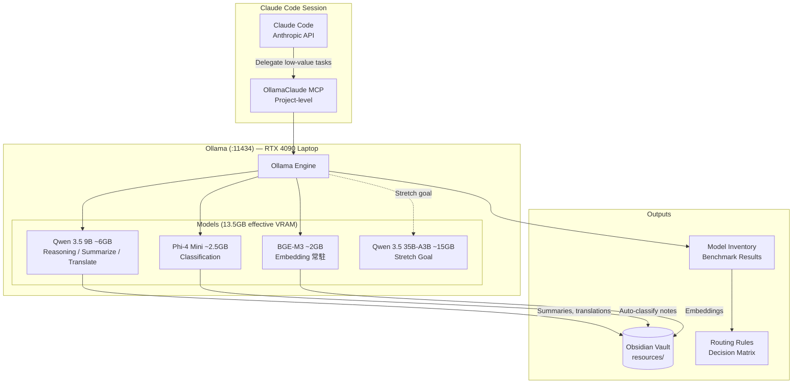

# feat: 本地 LLM 基礎設施 — RTX 4090 上的開源模型部署與整合

## Overview

在 RTX 4090 Laptop (16GB VRAM) 上部署本地開源 LLM，建立 Claude Code 的任務委派能力。透過 OllamaClaude MCP 讓 Claude Code 能將低價值任務（分類、摘要、翻譯）委派給本地模型，實現 70/30 混合策略（本地/雲端），降低 API 費用。

本計畫獨立於 [Plan 003 — LLM 技術自動調研管線](2026-03-29-003-feat-auto-llm-tech-research-pipeline-plan.md)，但兩者最終整合：Plan 003 的管線可選擇性使用本地模型降低運營成本。

## Problem Frame

sooneocean 的 RTX 4090 Laptop 閒置中——Ollama 0.17.0 已安裝但零本地模型（只有 cloud endpoints: minimax-m2.5, kimi-k2.5）。大量重複性任務（embedding、分類、摘要、翻譯）全部走 Claude API 付費，而這些任務本地 7-9B 模型就能勝任。

## Requirements Trace

- R1. 在 RTX 4090 Laptop (16GB VRAM, ~13.5GB effective) 上部署本地推論模型，覆蓋 embedding、分類、摘要、翻譯四大任務類型
- R2. 透過 MCP Server 讓 Claude Code 能委派低價值任務給本地模型，減少 API 費用和延遲
- R3. 定義明確的任務路由規則（decision matrix）：依任務類型、品質需求、隱私需求決定走本地或雲端
- R4. 建立本地模型效能基準測試，作為模型選型的 hard gate
- R5. OllamaClaude MCP 限定 project-level 配置，不影響其他 Claude Code 專案的安全邊界

## Scope Boundaries

- 本地 LLM 不取代 Claude Code 的核心推理（複雜規劃、code review、架構設計仍走 Claude API）
- 不做 fine-tuning（專注 inference-time 使用現成模型）
- 不建立多用戶服務（單人使用，不需 vLLM 高並發）
- 不建立 LiteLLM Proxy 統一閘道（單人 + 單引擎不需要；OllamaClaude MCP 已足夠）
- 不修改 Claude Code 的 `ANTHROPIC_BASE_URL`（避免攔截 Claude API 通訊造成單點故障）
- Qwen 3.5 35B-A3B 是 stretch goal，非默認選項（需 benchmark 驗證 13.5GB VRAM 可行性）

## Context & Research

### 硬體實際狀態

| 項目 | 數值 |
|------|------|
| GPU | RTX 4090 Laptop, 16,376 MiB total VRAM |
| VRAM effective | ~13.5GB（系統/display driver 佔 ~2.2GB） |
| 磁碟 free | **~491GB** on 1.83TB（vault note 中的 49GB 是過時快照） |
| CUDA | 12.4 + 12.6 dual install |
| Ollama | **v0.18.3** installed, 零本地模型（vault note 中的 0.17.0 是過時快照） |
| 其他 GPU 應用 | ComfyUI, LM Studio, ChatWithRTX — 共享 16GB VRAM，需注意共存 |
| Python SDKs | ollama 0.6.1, anthropic 0.76.0, openai 2.16.0, PyTorch 2.11+cu126 |

### 推論引擎選型

| 引擎 | 結論 |
|------|------|
| **Ollama** | **選用** — 一鍵管理、自動 GPU、OpenAI-compatible API、已安裝 |
| vLLM | 不選 — 高並發不需要、Windows 需 Docker/WSL2 |
| llama.cpp | 不選 — 無模型管理、需手動下載 |
| SGLang | 不選 — 生態太新、文件不完善 |

### 模型選型（13.5GB effective VRAM）

| 角色 | 模型 | VRAM | 磁碟 | 特色 |
|------|------|------|------|------|
| **Embedding（常駐）** | BGE-M3 | ~2GB | ~2.3GB | 多語言 dense+sparse、已在 Plan 003 決定 |
| **主力推理/摘要/翻譯** | Qwen 3.5 9B | ~6GB | ~6GB | 128K context、中英翻譯最強、阿里多語言 |
| **分類/標籤** | Phi-4 Mini 3.8B | ~2.5GB | ~2.5GB | 微軟 STEM 特化、秒回 |
| **Stretch goal** | Qwen 3.5 35B-A3B MoE | ~15-24GB | **~24GB** | Q4_K_M 實際 24GB；16GB VRAM 必定 CPU offload，效能大幅下降 |

**VRAM 並發組合：**
- Config A: BGE-M3 (2GB) + Qwen 3.5 9B (6GB) = **8GB** ✅ 舒適
- Config B: BGE-M3 (2GB) + Phi-4 Mini (2.5GB) = **4.5GB** ✅ 寬裕
- Config C: Qwen 3.5 35B-A3B alone = **~15GB** ⚠️ 可能需 CPU offload

**磁碟預算：** 3 模型 = ~11GB（491GB free 完全無壓力）；即使加上 35B stretch goal（24GB）也只用 ~35GB

**GPU 共存注意：** 本機還有 ComfyUI、LM Studio、ChatWithRTX 等 GPU 應用。跑 Ollama 推理時應關閉其他 GPU-heavy 應用，或確認 VRAM 餘量足夠。`/local-status` 應顯示 `nvidia-smi` VRAM 使用量。

### MCP 整合方案

| 方案 | 結論 |
|------|------|
| **OllamaClaude** (Jadael) | **選用** — 11 coding tools + 4 file-aware tools、file-aware 模式可顯著減少 token 傳輸（具體節省量需實測驗證） |
| ollama-mcp (rawveg) | 備選 — 14 tools + web search，但無 file-aware 優化 |
| Ollama Anthropic API 直連 | 不選 — 是「替換」Claude 而非「委派」 |
| LiteLLM Proxy | **不選** — 單人單引擎不需要；增加單點故障風險 |

### 70/30 混合策略

**本地 (70% 任務量):**
- Embedding (BGE-M3)
- Vault 筆記摘要
- 自動分類/標籤
- 中英翻譯
- Daily digest 生成
- 簡單 code completion
- 重複性批次任務

**Claude API (30% 任務量):**
- 複雜推理 & 規劃
- Code review
- 架構設計
- 長文脈絡分析（1M context）
- MCP 工具編排
- 創意寫作
- Agent 系統設計

### Institutional Learnings

- Windows Git Bash + jq 不穩定 → 管理腳本用 Python/Node.js
- Hooks 有 10 秒 timeout → Ollama 模型載入不放在 hook 中
- 子代理隔離是大規模探索的必要條件 → benchmark 用 subagent

### External References

- Ollama 0.18.3 官方文件 — OpenAI-compatible API、Anthropic-compatible API、GPU 設定
- OllamaClaude MCP — [Jadael/OllamaClaude](https://github.com/Jadael/OllamaClaude)
- Qwen 3.5 35B-A3B — [Qwen/Qwen3.5-35B-A3B](https://huggingface.co/Qwen/Qwen3.5-35B-A3B)
- Ollama RTX 4090 最佳化指南 — GPU layers、context size、batch size 設定

## Key Technical Decisions

- **Ollama 作為唯一推論引擎**: 零新工具學習成本，已安裝，OpenAI-compatible API。
  - *替代方案*: vLLM Docker → Windows 需 WSL2、setup 重、單人不需高並發

- **Qwen 3.5 9B 作為默認主力模型**: ~6GB VRAM，可與 BGE-M3 同時載入（總 8GB），128K context，中英翻譯最強。在 13.5GB effective VRAM 下穩定運行無壓力。
  - *替代方案*: 14B → ~10.7GB，品質更高但 VRAM 餘量小；35B MoE → ~15GB，超出 effective VRAM
  - *升級路徑*: 若 benchmark 證明 35B 可行（CPU offload 可接受），可升級

- **GGUF Q4_K_M 作為統一量化格式**: 品質/大小最佳平衡（~92% 品質保留），Ollama 原生支援。
  - *替代方案*: Q5_K_M → 品質稍高但檔案更大；AWQ/GPTQ → Ollama 不原生支援

- **OllamaClaude MCP 作為 Claude Code 委派橋樑**: Claude 明確決定哪些任務走本地（「conscious delegation」模式），而非透明攔截所有 API 呼叫。
  - *替代方案*: LiteLLM Proxy 攔截 → 單點故障 + Messages API 轉譯不完整

- **Project-level MCP 配置，非 Global**: OllamaClaude MCP 只在 dev-vault 專案啟用（`.claude/settings.json`），其他專案不受影響。
  - *依據*: 避免 injection-influenced session 透過本地模型工具繞過安全邊界

- **Unit 1 Benchmark 作為 Hard Gate**: 模型部署不是 setup 任務而是決策關卡。Benchmark 結果決定最終採用哪些模型。Go/no-go: < 30 tok/s → 降級到更小模型。

## Open Questions

### Resolved During Planning

- **推論引擎？** → Ollama（已安裝、一鍵管理）
- **主力模型？** → Qwen 3.5 9B（6GB VRAM、128K context）
- **量化格式？** → GGUF Q4_K_M（甜蜜點）
- **MCP 方案？** → OllamaClaude (Jadael)
- **統一閘道？** → 不需要（刪除 LiteLLM Proxy）
- **MCP 配置層級？** → Project-level（安全邊界）

### Deferred to Implementation

- OllamaClaude MCP 的 file-aware tools 在 Windows 路徑上的相容性（backslash 處理）
- Ollama keep_alive 設定最佳值（多久自動卸載閒置模型）
- Qwen 3.5 35B-A3B 在 13.5GB effective VRAM 上的實際表現（需 CPU offload 嗎？tok/s？）
- 70/30 比例的實際準確性（需 2-4 週使用數據驗證）

## High-Level Technical Design

> *This illustrates the intended approach and is directional guidance for review, not implementation specification.*

## Implementation Units

- [ ] **Unit 1: Local Model 部署 + Benchmark + 路由規則**

**Goal:** 在 RTX 4090 Laptop 上部署精選本地模型，執行效能基準測試作為 hard gate，建立任務路由決策矩陣

**Requirements:** R1, R3, R4

**Dependencies:** None

**Files:**
- Create: `projects/tools/local-llm/benchmark.py` — 效能基準測試腳本
- Create: `projects/tools/local-llm/model-inventory.md` — 模型清單 + benchmark 結果
- Create: `resources/local-llm-deployment.md` — vault note：部署決策、benchmark 數據、路由規則
- Test: `projects/tools/local-llm/tests/test_benchmark.py`

**Approach:**
- **模型拉取順序**（依優先級）：
  1. `ollama pull bge-m3` (~2.3GB) — embedding 常駐，Plan 003 Phase 3 也需要
  2. `ollama pull qwen3.5:9b` (~6GB) — 主力推理/摘要/翻譯
  3. `ollama pull phi4-mini` (~2.5GB) — 分類/標籤
  4. （Stretch）`ollama pull qwen3.5:35b-a3b` (~20GB) — 需先驗證 VRAM
- **Ollama 環境變數最佳化**: `OLLAMA_GPU_LAYERS=999`, `OLLAMA_CONTEXT_SIZE=8192`, `OLLAMA_BATCH_SIZE=512`
- **Benchmark**: 每個模型跑標準 prompt set：
  - 分類: 10 篇 vault 筆記 → 模型判斷 area/project/resource/idea
  - 摘要: 10 篇筆記 → 生成 3 句摘要 → 與 Claude 摘要比對品質
  - 翻譯: 10 段中英互譯 → 比對品質
  - 推理: 10 個簡單問題 → 比對正確率
  - 記錄 tok/s、VRAM peak、品質 score vs Claude baseline
- **Hard gate**: tok/s < 30 → 不採用；品質 vs Claude < 70% → 不用於該任務
- **路由規則**: 根據 benchmark 結果建立決策矩陣 vault note，按 5 維度：
  - 品質需求（高→Claude, 低→本地）
  - 隱私需求（高→本地, 低→任一）
  - 延遲敏感（高→本地, 低→任一）
  - 批量大小（大→本地, 小→任一）
  - 推理複雜度（高→Claude, 低→本地）

**Patterns to follow:**
- `resources/dexg16-ai-stack.md` 的 AI Stack 盤點格式
- sprint reflection 模板記錄測試結果

**Test scenarios:**
- Happy path: `ollama pull bge-m3` 成功 → embedding 測試返回正確向量 → VRAM ~2GB
- Happy path: `ollama pull qwen3.5:9b` 成功 → 推理測試 ≥ 30 tok/s → 品質 ≥ 70% Claude baseline
- Happy path: BGE-M3 + Qwen 3.5 9B 同時載入 → 總 VRAM ~8GB → 穩定運行
- Edge case: 磁碟空間不足以下載 35B stretch goal → 跳過，記錄到 inventory
- Edge case: 模型 tok/s < 30 → 標記為 FAIL，不納入路由規則
- Error path: Ollama 未運行 → 清晰錯誤 "ollama serve not detected"
- Integration: benchmark 結果自動寫入 model-inventory.md 和 vault note

**Verification:**
- 至少 3 個本地模型成功載入並通過 hard gate
- model-inventory.md 包含每個模型的 VRAM peak、tok/s、品質 score
- 路由規則 vault note 覆蓋所有任務類型
- VRAM 並發測試通過（BGE-M3 + Qwen 9B 同時運行）

---

- [ ] **Unit 2: OllamaClaude MCP 任務委派整合**

**Goal:** 讓 Claude Code 能透過 MCP 將低價值任務委派給本地 Ollama 模型

**Requirements:** R2, R5

**Dependencies:** Unit 1（模型已部署且通過 benchmark）

**Files:**
- Create: `.claude/settings.json` — project-level MCP 配置（OllamaClaude）
- Create: `projects/tools/local-llm/ollama-claude/` — OllamaClaude MCP server（git clone）
- Create: `.claude/commands/local-status.md` — `/local-status` 查看本地模型狀態
- Test: 手動驗證 MCP tools 在 Claude Code session 中可用

**Approach:**
- **Spike 驗證（前置步驟）**: OllamaClaude 只有 9 stars、AGPL-3.0，是個人專案。官方 README 顯示回應時間 60-180 秒。先做 30 分鐘 spike：安裝 → 跑一個 `ollama_general_task` → 驗證 Windows 路徑相容性和回應時間。如果不可接受，改用 `rawveg/ollama-mcp`（14 tools）或自建簡易 MCP wrapper
- **安裝**: `git clone https://github.com/Jadael/OllamaClaude.git` 到 `projects/tools/local-llm/ollama-claude/` + `npm install`
- **Project-level MCP 配置**: 在 `.claude/settings.json`（專案層級，非 global）新增 OllamaClaude MCP server
- **預設模型**: 設為 `qwen3.5:9b`（通過 benchmark 的主力模型）
- **可用 tools（11 + 4）**:
  - String-based: `ollama_generate_code`, `ollama_explain_code`, `ollama_review_code`, `ollama_refactor_code`, `ollama_fix_code`, `ollama_write_tests`, `ollama_general_task`
  - File-aware: `ollama_review_file`, `ollama_explain_file`, `ollama_analyze_files`, `ollama_generate_code_with_context`
- **委派場景**:
  - `ollama_general_task` — 分類、摘要、翻譯等通用任務
  - `ollama_review_file` — 初步 code review（Claude 做最終 review）
  - `ollama_explain_code` — 程式碼解釋（vault 筆記素材）
- **`/local-status`**: 顯示 Ollama 運行狀態、已載入模型、VRAM 使用

**Patterns to follow:**
- 現有 `.claude/commands/*.md` 的 slash command 格式
- Plan 003 的 MCP server 配置模式

**Test scenarios:**
- Happy path: Claude Code session 中呼叫 `ollama_general_task` → 本地模型回應 → 結果正確
- Happy path: 呼叫 `ollama_review_file` 指定 Python 檔案 → 本地模型返回 review comments
- Happy path: 呼叫 `ollama_explain_code` → 返回中文解釋（多語言能力）
- Edge case: Ollama 未運行 → MCP tool 返回清晰錯誤，Claude 用自己的能力完成任務
- Edge case: 本地模型品質不足 → Claude 偵測到並自行重做
- Edge case: Windows 路徑含 backslash → file-aware tools 正確處理
- Error path: OllamaClaude MCP server crash → 不影響其他 MCP tools 和 Claude Code
- Integration: `/local-status` 在 Claude Code session 中可用並顯示正確狀態

**Verification:**
- `.claude/settings.json` 中 OllamaClaude MCP 配置完成（project-level）
- 至少 5 個 MCP tools 在 Claude Code session 中成功返回結果
- File-aware tools 在 Windows 路徑上正確運作
- `/local-status` 顯示正確的 Ollama 狀態和模型清單

---

- [ ] **Unit 3: 品質驗證 + 成本追蹤 + Vault 文件化**

**Goal:** 驗證 70/30 混合策略的實際品質，建立成本追蹤，將所有發現文件化到 vault

**Requirements:** R3, R4

**Dependencies:** Unit 2

**Files:**
- Create: `projects/tools/local-llm/quality-test.py` — A/B 品質比較腳本
- Create: `resources/local-llm-quality-report.md` — vault note：品質測試結果
- Modify: `resources/local-llm-deployment.md` — 更新部署狀態和成本分析
- Create: `.claude/commands/local-cost.md` — `/local-cost` 使用量統計

**Approach:**
- **A/B 品質測試**: 每個遷移任務做 10 次 local vs Claude 品質比較
  - 分類: Phi-4 Mini vs Claude → 準確率比較
  - 摘要: Qwen 3.5 9B vs Claude → 人工評分（1-5）
  - 翻譯: Qwen 3.5 9B vs Claude → 流暢度和準確度比較
  - 閾值: 品質損失 > 10% → 該任務不遷移
- **成本追蹤**: `/local-cost` 估算每週/每月的 API 費用節省
  - 基於 Ollama 免費 + Claude API pricing 計算
  - 記錄每個任務類型的 local vs cloud 使用次數
- **Vault 文件化**: 所有結果寫入 vault resource notes
- **回饋到 Plan 003**: 如果品質夠好，記錄哪些管線任務可用本地模型

**Patterns to follow:**
- sprint reflection 模板（did/learned/stuck/try next）
- Plan 001 的 improvement-proposal 風險分層模式

**Test scenarios:**
- Happy path: 分類 A/B 測試 → Phi-4 Mini 準確率 ≥ 90% → 通過
- Happy path: 摘要 A/B 測試 → Qwen 3.5 9B 品質 ≥ 3.5/5 → 通過
- Edge case: 翻譯品質不合格（< 70%）→ 翻譯任務保留 Claude API
- Edge case: 某些類型的分類準確率低（如 area vs project 邊界模糊）→ 細化 prompt
- Integration: `/local-cost` 在 Claude Code session 中顯示正確統計

**Verification:**
- 品質報告 vault note 完成，覆蓋所有任務類型
- 至少 2 個任務類型通過 A/B 品質門檻
- `/local-cost` 可正常估算費用節省
- 部署文件更新到最終狀態

## System-Wide Impact

- **Interaction graph:** Claude Code → OllamaClaude MCP (project-level) → Ollama (:11434) → Local Models (BGE-M3, Qwen 3.5 9B, Phi-4 Mini)
- **Error propagation:** OllamaClaude MCP 失敗 → Claude Code 用自身能力完成任務（graceful degradation）。Ollama 停機 → 所有 MCP tools 返回錯誤，其他功能不受影響
- **State lifecycle risks:**
  - Ollama 模型佔用 VRAM → keep_alive 自動卸載 + 手動 `ollama stop`
  - 模型版本更新 → model-inventory.md 需要重新 benchmark
- **API surface parity:** `/local-status`、`/local-cost` 兩個 slash command
- **Integration coverage:** OllamaClaude MCP → Ollama → vault note output 的端對端測試
- **Unchanged invariants:**
  - Claude Code 直連 Anthropic API 行為不變
  - Global settings.json 不受影響（project-level 配置）
  - 現有 14 plugins、47 agents 不受影響
  - Plan 003 調研管線獨立運行不受影響

## Risks & Dependencies

| Risk | Likelihood | Impact | Mitigation |
|------|-----------|--------|------------|
| Qwen 3.5 9B 品質不如預期 | Medium | Medium | A/B 測試 hard gate；不合格的任務保留 Claude API |
| OllamaClaude MCP Windows 路徑不相容 | Low | Medium | Unit 2 測試驗證；必要時 PR 修復或用 rawveg/ollama-mcp 替代 |
| 49GB 磁碟空間限制模型數量 | Low | Low | 3 模型只需 ~11GB；35B stretch goal 視空間決定 |
| Ollama + Claude Code 同時佔用 VRAM/RAM | Medium | Medium | Config A (BGE-M3+9B=8GB) 遠低於 13.5GB 上限 |
| 70/30 比例不準確 | Medium | Low | 2-4 週使用數據後調整比例 |

## Phased Delivery

### Phase 1 — 部署 + Benchmark（1-2 天）
- Unit 1: 拉取模型、benchmark、路由規則
- **這是 hard gate** — benchmark 結果決定後續是否繼續

### Phase 2 — MCP 整合（1 天）
- Unit 2: OllamaClaude MCP 安裝和驗證
- 前置條件：Unit 1 通過 hard gate

### Phase 3 — 品質驗證 + 文件化（2-3 天）
- Unit 3: A/B 測試、成本追蹤、vault 文件化
- 完成後可選：將結果回饋到 Plan 003 的管線本地化

## Documentation / Operational Notes

- 部署完成後更新 `resources/dexg16-ai-stack.md` 的 Ollama 區段
- OllamaClaude MCP 安裝說明寫入 `projects/tools/local-llm/README.md`
- 品質報告和路由規則作為 vault resource notes 永久保存
- 模型升級時需重跑 benchmark（更新 model-inventory.md）

## Sources & References

- Related plan: [Plan 003 — LLM 技術自動調研管線](2026-03-29-003-feat-auto-llm-tech-research-pipeline-plan.md)
- Hardware specs: `resources/dexg16-machine-specs.md`, `resources/dexg16-ai-stack.md`
- OllamaClaude MCP: [Jadael/OllamaClaude](https://github.com/Jadael/OllamaClaude) — 11 coding tools + file-aware
- ollama-mcp: [rawveg/ollama-mcp](https://github.com/rawveg/ollama-mcp) — 備選 MCP 方案
- Qwen 3.5 9B: Ollama model library
- Phi-4 Mini: Microsoft Phi-4 Mini 3.8B
- BGE-M3: [BAAI/bge-m3](https://huggingface.co/BAAI/bge-m3) — 多語言 dense+sparse embedding
- Ollama RTX 4090 最佳化: GPU layers, context size, batch size 設定指南
